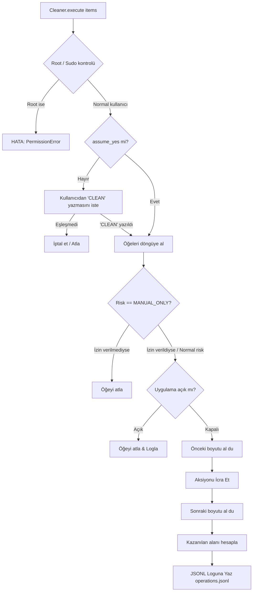

# DeepClean Geliştirici ve Mimari Kılavuzu (`developer.md`)

Bu doküman; **DeepClean** projesinin mimarisini, tasarım ilkelerini, kod tabanı hiyerarşisini, güvenlik sınırlarını ve çalışma prensiplerini en ince ayrıntısına kadar açıklamak amacıyla hazırlanmıştır. Projeye katkıda bulunacak veya bakımını üstlenecek bir yazılım mühendisinin ihtiyaç duyacağı tüm teknik detayları içerir.

---

## 1. Giriş ve Proje Özeti

### 1.1 Projenin Amacı
**DeepClean**, macOS ekosistemi için tasarlanmış; güvenli, hızlı, modüler ve kullanıcı dostu bir sistem temizleme, uygulama kaldırma, disk analizi ve geliştirici araçları bakım yazılımıdır. 

Proje, geleneksel temizleme yazılımlarının getirdiği körlemesine silme (`rm -rf` çılgınlığı) ve gereksiz `sudo`/root yetkisi isteme alışkanlıklarını reddeder. Sistem bütünlüğünü (macOS SIP, TCC) ve kullanıcı verilerini koruyan katı bir güvenlik sözleşmesi (*Safety Contract*) üzerine inşa edilmiştir.

### 1.2 Temel Tasarım İlkeleri
1. **Zero-Privilege Contract (Asla Root Olarak Çalışmama):** CLI, TUI, Web UI ve kurulum betikleri root (`sudo`) ile çalıştırılmayı açıkça reddeder (`os.geteuid() == 0` kontrolü). macOS izin mekanizmalarını atlatmaya çalışmaz.
2. **Fail-Closed Güvenlik:** Bir yolun, hedefin veya sahipliğin güvenli olduğundan %100 emin olunamıyorsa operasyon derhal iptal edilir.
3. **Reversibility (Geri Alınabilirlik):** Geliştirici proje çıktıları, disk analizörü silme işlemleri, uygulama kalıntıları ve eski yükleyiciler doğrudan silinmez; macOS çöp kutusuna (`~/.Trash`) taşınır.
4. **Manager-Owned Deletions:** Geliştirici ortamları, dilleri (runtimes), paketleri ve SDK'leri asla ham dosya silme ile kaldırılmaz; doğrudan o aracı yöneten resmi araç (`mise`, `nvm`, `brew`, `sdkmanager`, `rustup`, `simctl` vb.) üzerinden kaldırılır.
5. **Non-Blocking / Responsive UI:** Disk I/O ve sistem taramaları UI event loop'unu kilitlemez. Textual TUI worker'ları ve Web UI arka plan iş parçacıkları (thread pool) ile kullanıcı arayüzü daima akıcı kalır.
6. **Destructive Post-Condition Verification:** Bir silme veya taşıma işlemi yapıldıktan sonra hedefin gerçekten kaldırıldığı, taşındığı yerin mevcut olduğu teyit edilir.

---

## 2. Teknoloji Yığını ve Paketleme

* **Programlama Dili:** Python 3.11+
* **Paket ve Ortam Yöneticisi:** [uv](https://docs.astral.sh/uv/) (`uv.lock`, `pyproject.toml`)
* **Terminal UI (TUI):** [Textual](https://textual.textualize.io/) (v6.0 - v8.0)
* **Sistem Metrikleri:** [psutil](https://github.com/giampaolo/psutil) (>= 7.0.0)
* **Web UI Frontend:** Vanilla HTML5, CSS3 (Modern dark glassmorphism), Vanilla JavaScript (ES6+) — *Hiçbir dış derleme adımı (Webpack, Vite vs.) gerektirmez.*
* **Web UI Backend:** Python `http.server.ThreadingHTTPServer` (Zero external framework - FastAPI veya Flask bağımlılığı yoktur)
* **Test Çatısı:** `pytest` (>= 8.3.0)
* **Build Backend:** `uv_build` (Wheel içine `deepclean/WebUI` statik dosyaları gömülür)

---

## 3. Dizin ve Dosya Yapısı

```text
DeepClean-PYTHON/
├── .gitignore
├── .python-version          # Hedef Python sürümü (3.11)
├── FALLBACK_POLICY.md       # Fallback matrisi ve katı fallback kuralları
├── LICENSE                  # MIT Lisansı
├── Makefile                 # Geliştirici kısayolları (sync, check, test, build)
├── PYTHON_PORT_AUDIT.md     # Kod tabanı denetim raporu
├── README.md                # Genel kullanıcı dokümantasyonu
├── SECURITY.md              # Kapsamlı güvenlik modeli ve sınırları
├── install.sh               # Kullanıcı seviyesinde 'uv tool' kurulum betiği
├── pyproject.toml           # Proje metadata, bağımlılıklar ve CLI script tanımı
├── start-web.sh             # Web arayüzünü başlatan yardımcı kabuk betiği
├── uninstall.sh             # Temiz kaldırma betiği
├── uv.lock                  # Kilitli bağımlılık ağacı
├── tests_py/                # Pytest birim ve entegrasyon testleri
│   ├── test_analyzer.py     # Artımlı analizör testleri
│   ├── test_core.py         # Güvenlik, profil ve CLI testleri
│   ├── test_tui.py          # Textual TUI arayüz testleri
│   └── test_web.py          # HTTP sunucu ve API güvenlik testleri
└── src/
    └── deepclean/           # Çekirdek Python paketi
        ├── __init__.py      # Sürüm bilgisi ve CLI giriş yönlendiricisi
        ├── analyzer.py      # Artımlı, non-blocking disk analizörü
        ├── cleaner.py       # Temizleme ve silme motoru (Execution engine)
        ├── cli.py           # Argparse tabanlı komut satırı arayüzü
        ├── config.py        # Konfigürasyon ve Whitelist yönetimi
        ├── developer.py     # Geliştirici envanteri ve araç yöneticisi
        ├── features.py      # Uygulama yönetimi, Project Purge, Optimizasyon, Sistem Durumu
        ├── models.py        # Veri modelleri, Enum'lar ve Dataclass'lar
        ├── safety.py        # Yol güvenliği ve silme koruma katmanı (PathSafety)
        ├── system.py        # İşletim sistemi çağrıları, du, pgrep, subprocess sarmalayıcıları
        ├── tui.py           # Textual ile tam teşekküllü TUI paneli
        ├── web.py           # Yerel HTTP sunucusu ve REST API uç noktaları
        └── WebUI/           # Web paneli statik varlıkları
            ├── app.js       # Web UI ön yüz reaktif mantığı
            ├── index.html   # Modern SPA tek sayfa yapısı
            └── styles.css   # Dark modern tema ve responsive CSS
```

---

## 4. Veri Modelleri ve Tip Hiyerarşisi (`models.py`)

`models.py` modülü; sistem genelinde kullanılan veri modellerini, risk seviyelerini ve temizleme profillerini tanımlar. `slots=True` kullanımı ile bellek performansı optimize edilmiştir.

### 4.1 `RiskLevel` (IntEnum)
* `SAFE (0)`: Tamamen güvenli, uygulamanın veya sistemin kendi yeniden üretebileceği geçici önbellekler.
* `MODERATE (1)`: Sistem genel önbellekleri, simülatör önbellekleri, kaydedilmiş oturum durumları.
* `AGGRESSIVE (2)`: Yeniden derleme gerektirebilecek veya paket yöneticisi global önbellekleri (`npm cache --force` gibi).
* `MANUAL_ONLY (3)`: Asla otomatik olarak seçilmeyen, ikinci bir etkileşimli kullanıcı onayı gerektiren, yalnızca çok katı allowlist kurallarına uyan önbellekler.

### 4.2 `CleanupProfile` (StrEnum)
* `SAFE ("safe")`: Yalnızca `RiskLevel.SAFE` öğeleri hedefler. Geliştirici önbelleklerini içermez.
* `DEEP ("deep")`: `RiskLevel.MODERATE` seviyesine kadar olan sistem, tarayıcı ve uygulama önbelleklerini hedefler.
* `DEVELOPER ("developer")`: `DEEP` profiline ek olarak geliştirici araçları (`DerivedData`, paket yöneticileri) önbelleklerini hedefler (`includes_developer = True`).
* `AGGRESSIVE ("aggressive")`: `RiskLevel.AGGRESSIVE` seviyesine kadar olan tüm öğeleri hedefler.

### 4.3 `ActionType` (StrEnum) ve `CleanupAction`
Operasyonun nasıl icra edileceğini belirler:
* `REMOVE_PATH`: Tek bir dosya veya klasörün kendisini kaldırır.
* `REMOVE_CHILDREN`: Hedef dizinin kendisini korur, yalnızca içindeki çocukları temizler (Örn: `DerivedData` kökünü silmeyip içindekileri silmek).
* `COMMAND`: Resmi aracın CLI komutunu çalıştırır (`brew cleanup`, `pnpm store prune` vb.).
* `COMMAND_WITH_CACHE_FALLBACK`: Önce komut denenir, gerekirse kısıtlı fallback yapılır.
* `MANUAL_CACHE_FALLBACK`: Sadece onaylanmış yönetici önbellek köklerinde manuel temizlik.
* `MOVE_TO_TRASH`: Dosyayı kalıcı silmek yerine `~/.Trash`'e taşır.

### 4.4 `CleanupItem` (Dataclass)
Her bir temizleme adayını temsil eden zengin nesne:
* `category`: `CleanupCategory` (User caches, Browser caches, Developer tools vb.)
* `label`: Kullanıcıya gösterilen açıklayıcı başlık.
* `path`: Hedef dosya yolu (`Path | None`).
* `estimated_bytes`: Boyut (bayt cinsinden).
* `risk`: `RiskLevel`.
* `reason`: Neden temizlenebilir olduğu.
* `action`: `CleanupAction` nesnesi.
* `requires_app_closed`: Eğer bu önbellek silinirken bir uygulamanın kapalı olması gerekiyorsa uygulama adı (örn. `Google Chrome.app`).
* `id`: UUIDv4 string (Web UI ve TUI seçim takibi için).

---

## 5. Güvenlik Çekirdeği ve Whitelist Sistemi

DeepClean'in en kritik modülleri `safety.py` ve `config.py`'dir. Kod tabanına dokunan her geliştiricinin bu iki modüldeki güvenlik kapılarını tam olarak anlaması şarttır.

### 5.1 Sabit Engelli Sistem Kökleri (`PathSafety.HARD_BLOCKED`)
Aşağıdaki kökler ve doğrudan bu köklerin kendisi asla hedef alınamaz:
```python
HARD_BLOCKED = {
    Path("/"), Path("/System"), Path("/bin"), Path("/sbin"), Path("/usr"),
    Path("/etc"), Path("/var"), Path("/private"), Path("/Library"),
    Path("/Applications"), Path("/Users"), Path("/Volumes"),
}
```

### 5.2 Silme Kapısı (`PathSafety.validate_deletion_path`)
Herhangi bir dosya/klasör silinmeden hemen önce (`cleaner.py` içinde) bu fonksiyondan geçmek **zorundadır**:
1. **Lexical Normalizasyon (`_lexical`):** Boş karakter (`\0`), satır sonları (`\n`, `\r`) veya `..` (directory traversal) içeren yollar `PathSafetyError` fırlatır. Yol mutlak (`absolute`) ve normalize (`os.path.normpath`) hale getirilir.
2. **Kök Engeli:** `HARD_BLOCKED` listesindeki yollar reddedilir.
3. **İzin Verilen Kökler (Allowlisted Roots):** Yol; kullanıcının `~/Library/Caches`, `~/Library/Logs`, `~/.npm`, `~/.gradle/caches`, `~/.cargo/registry/cache`, `~/Library/Developer/Xcode/DerivedData` gibi açıkça izin verilmiş kökleri altında olmak zorundadır.
4. **Sandbox & App Support İstisnaları:**
   - Sandbox önbellekleri yalnızca `~/Library/Containers/<bundle_id>/Data/Library/Caches` şablonuna uyuyorsa kabul edilir.
   - `Application Support` altında yalnızca bilinen güvenli tarayıcı (Chrome, Brave, Edge, Chromium) profil önbellek yaprakları (`Cache`, `Code Cache`, `GPUCache` vb.) ve onaylı geliştirici araçları (VS Code, Cursor, Slack) önbellek yaprakları kabul edilir. `Application Support` ana dizini veya veritabanları ASLA silinemez.
5. **Symlinked Ancestor Kontrolü (`_reject_symlink_ancestors`):** Hedef yolun ebeveynlerinden herhangi biri sembolik link (symlink) ise işlem derhal engellenir. Bu, symlink yönlendirmesiyle sistem dışı veya yetkisiz yerlerin silinmesini engeller.

### 5.3 Disk Analizörü Çöp Kutusu Kapısı (`validate_analyzer_candidate`)
Kullanıcı disk analizöründen bir dosyayı Trash'e göndermek istediğinde normal temizlikten bile daha katı bir denetim uygulanır:
- Hedef yol mutlak surette `Path.home()` altında olmalıdır (`home not in path.parents`).
- Kullanıcı ana klasörünün doğrudan kendisi (`~`) veya ana anchor klasörleri (`~/Library`, `~/Applications`, `~/Desktop`, `~/Documents`, `~/Downloads`, `~/Pictures` vb.) silinemez.
- `~/Library` ve altındaki hiçbir dosya analizörden silinemez (yalnızca izleme amaçlıdır; temizlik motoru üzerinden temizlenmelidir).
- `.app` paketleri ve `.photoslibrary` gibi kütüphaneler korumalıdır.
- Hedef dosyanın dosya sistemi sahipliği (`st_uid`) mevcut kullanıcının UID'si (`os.getuid()`) ile eşleşmelidir.

### 5.4 Yapılandırma ve Whitelist (`config.py`)
- **Konfigürasyon Dizini:** `~/.config/deepclean/`
- **Whitelist Dosyası:** `~/.config/deepclean/whitelist`
- **Log Dizini:** `~/Library/Logs/DeepClean/` (`operations.jsonl`)
- **Dinamik Kontrol:** `Config.is_whitelisted(path)` metodu, whitelist dosyasını her işlem anında baştan okur. Böylece tarama yapıldıktan sonra bile kullanıcı whitelist dosyasına bir kural eklediyse, temizleme anında o yol korunur. Hem tam yol öneki (`prefix`) hem de Unix glob desenleri (`fnmatch.fnmatch`) desteklenir.

---

## 6. Sistem Entegrasyonu ve Süreç İletişimi (`system.py`)

İşletim sistemiyle iletişim kuran tüm düşük seviyeli fonksiyonlar `system.py` altında toplanmıştır:

* **`run_command(executable, arguments, timeout=120, on_wait=None)`:**
  `subprocess.Popen` kullanarak komutları yeni bir session (`start_new_session=True`) içinde çalıştırır. Belirtilen zaman aşımı aşıldığında süreci öldürür (`process.kill()`). Deadlock oluşmaması için çıktıları güvenli şekilde yakalar.
* **`process_running(needle)`:** `pgrep -f` kullanarak belirli bir sürecin (örn. `Google Chrome`, `CoreSimulator`) arka planda çalışıp çalışmadığını kontrol eder.
* **`size_of(path)`:** Boyut hesaplamasında standart `os.stat` yerine macOS'un yerel `/usr/bin/du -sk` aracını kullanır. Bu, APFS dosya sistemindeki sparse dosyaları, klonları ve sıkıştırılmış blokları en doğru şekilde ölçer.
* **`sizes_of(paths, max_workers=4)`:** Çok sayıda yolun boyutunu `ThreadPoolExecutor` ile paralel olarak hesaplar.
* **`unique_trash_destination(path)`:** macOS Finder davranışına benzer şekilde, `~/.Trash` içerisine taşınacak bir dosyanın adı zaten varsa otomatik olarak `dosya 1`, `dosya 2` şeklinde benzersiz bir isim üretir.
* **`human_bytes(value)`:** Bayt değerlerini insan tarafından okunabilir (B, KB, MB, GB, TB) biçime dönüştürür.

---

## 7. Tarama ve Keşif Motoru (`scanner.py`)

`scanner.py`, sistemdeki potansiyel temizlik adaylarını tespit eden motorları barındırır.

### 7.1 `Scanner` Sınıfı ve Tarama Fazları
`Scanner.scan()` çağrıldığında aşağıdaki fazlar sırayla yürütülür ve her fazda bir callback ile ilerleme durumu (`Progress: (percent, phase, path)`) iletilir:
1. `User caches`: `~/Library/Caches` taranır. Apple sistem servisleri (`com.apple.bird`, `CloudDocs`, `accountsd` vb.) hariç tutulur.
2. `Browser caches`: Chrome, Brave, Edge, Chromium ve Firefox profil dizinleri altındaki `Cache`, `Code Cache`, `GPUCache` vb. taranır. Kullanıcı veritabanları, geçmiş ve çerezler asla dahil edilmez.
3. `Application caches`: VS Code, Cursor, Slack, Discord, Spotify gibi popüler uygulamaların önbellek yaprakları taranır.
4. `Sandbox caches`: `~/Library/Containers/*/Data/Library/Caches` taranır.
5. `Logs & diagnostics`: `~/Library/Logs` ve `DiagnosticReports` altındaki eski loglar (Safe profilde >7 gün, diğerlerinde >1 gün) taranır. DeepClean'in kendi log dizini korunur.
6. `Developer tools` (Developer profili aktifse): `Xcode/DerivedData`, `CoreSimulator/Caches`, CocoaPods, SwiftPM, Carthage önbellekleri taranır.
7. `Package-manager caches`: `PackageManagerCacheScanner` tetiklenir.
8. `Saved application state` (Deep ve Aggressive profilde): `~/Library/Saved Application State` taranır.
9. `Temporary files` (İsteğe bağlı): `/private/tmp` ve `/private/var/tmp` altındaki kullanıcıya ait eski dosyalar taranır.
10. `Trash` (İsteğe bağlı): `~/.Trash` içeriği taranır.

### 7.2 Paket Yöneticisi Önbellekleri (`PackageManagerCacheScanner`)
Desteklenen araçlar:
* **Homebrew:** `brew cleanup --prune=all`
* **pnpm:** `pnpm store prune`
* **uv:** `uv cache prune`
* **Go:** `go clean -cache -testcache`
* **Bun:** `bun pm cache rm`
* **Python Pip:** `python3 -m pip cache purge`
* **Yarn:** Yarn 1.x ise `yarn cache clean`, Yarn 2+ (Berry) ise proje bazlı olduğu için atlanır.
* **Composer:** `composer clear-cache`
* **.NET / NuGet:** `dotnet nuget locals ... --clear`
* **npm:** `npm cache clean --force` (Aggressive risk)
* **Conda & Micromamba:** `conda clean --all -y`, `micromamba clean --all --yes`
* **Pipx, Pixi, Gradle, Cargo, Maven, Dart/Flutter:** İlgili CLI komutları veya katı allowlist fallback'leri. Docker/Podman konteyner ve imajları veri kaybını önlemek için kasıtlı olarak otomatik temizliğe dahil edilmez.

### 7.3 Yükleyiciler ve Artık Dosyalar
* **`scan_installers(older_than_days=30)`:** `Downloads` ve `Desktop` altında bulunan `.dmg`, `.pkg`, `.iso`, `.xip` dosyalarını tespit eder.
* **`scan_leftovers(...)`:** `/Applications` ve `~/Applications` altındaki `.app` paketlerinin `Info.plist` dosyalarından `CFBundleIdentifier` listesi çıkarır. Ardından `~/Library/Caches`, `~/Library/Logs`, `~/Library/Saved Application State` dizinlerini tarayarak, sistemde artık uygulaması bulunmayan ters-DNS formatındaki artık dosyaları listeler.

---

## 8. Temizleme ve Yürütme Motoru (`cleaner.py`)

`Cleaner` sınıfı, tarama sonucunda seçilen `CleanupItem` listesini icra eder:



### 8.1 Güvenlik ve Doğrulama Adımları
1. **Root Kontrolü:** `os.geteuid() == 0` ise anında `PermissionError` verir.
2. **Çalışan Uygulama Denetimi (`requires_app_closed`):** İlgili uygulama çalışıyorsa (`pgrep`), o öğe atlanır ve kullanıcıya uygulamayı kapatması bildirilir.
3. **Manuel Fallback İkinci Onay Şartı:** `ActionType.MANUAL_CACHE_FALLBACK` olan öğeler `allow_manual_fallback=True` parametresi açıkça verilmedikçe atlanır.
4. **Post-Condition (Son Durum) Doğrulaması:**
   - `REMOVE_PATH`: Yolun silindiği (`path.exists() == False`) doğrulanır.
   - `REMOVE_CHILDREN`: Dizindeki whitelist dışındaki tüm çocukların silindiği doğrulanır.
   - `MOVE_TO_TRASH`: Kaynak dosyanın yok olduğu ve hedef çöp kutusu dosyasının var olduğu teyit edilir.
5. **Denetim İzi (Audit Log):** Her operasyon sonucu `~/Library/Logs/DeepClean/operations.jsonl` dosyasına JSON satırı olarak yazılır.

---

## 9. Disk Alanı Analizörü Mimarisi (`analyzer.py`)

`IncrementalAnalyzer` sınıfı, kullanıcıların disk alanını interaktif olarak keşfetmesini sağlayan, bloke etmeyen (non-blocking) gelişmiş bir analiz motorudur.

### 9.1 Çalışma Mantığı ve Navigasyon Önbelleği
1. **Anında Dizin Listeleme:** Bir klasöre girildiğinde (`snapshot(path)`), alt dizin ve dosyalar senkron olarak hızlıca okunur (`path.iterdir()`) ve arayüze anında döner.
2. **Arka Plan Ölçüm Havuzu (`ThreadPoolExecutor`):** Alt dizinlerin derinlemesine boyutları arka planda bağımsız iş parçacıkları tarafından ölçülür (`_walk` fonksiyonu `os.scandir` ile symlinkleri takip etmeden çalışır).
3. **Navigasyon Pausing (Duraklatma):** Kullanıcı bir dizin taranırken başka bir dizine geçerse, önceki dizinin tarama işi duraklatılır (`paused = True`, futures iptal edilir) ve yeni dizine öncelik verilir. Disk I/O boşa harcanmaz.
4. **Önbellekten Devam Etme:** Kullanıcı daha önce gezindiği üst dizine geri döndüğünde, önceden ölçülmüş değerler önbellekten anında sunulur ve sadece tamamlanmamış öğelerin ölçümü arka planda kaldığı yerden sürdürülür.
5. **Stale Poll Koruması (`focus_id` / `generation`):** Tarayıcı veya TUI'dan gelen eski zamanlı isteklerin aktif analiz dizinini bozmasını engellemek için `generation` ve `focus_id` numaralandırması kullanılır.

---

## 10. Geliştirici Envanteri (`developer.py`)

Geliştirici sistemlerinde biriken büyük runtime, SDK ve ortamların envanterini çıkarır ve yönetir.

### 10.1 Kategoriler
* **`runtime`:** Dil sürümleri (`pyenv`, `rbenv`, `nodenv`, `rustup`, `uv-python`, `nvm`, `fnm`, `sdkman`, `mise`, `asdf`, `homebrew`).
* **`environment`:** Python/Conda sanal ortamları (`conda`, `micromamba`, `poetry`).
* **`tool`:** Global kurulu CLI araçları (`brew leaves`, `pipx`, `uv tool`, `npm -g`, `pnpm -g`, `cargo install`).
* **`sdk`:** Android SDK platform/build-tools/NDK/sistem imajları, Android AVD emülatörleri, Xcode Simülatörleri (`xcrun simctl`) ve DeviceSupport dosyaları.

### 10.2 Korumalı Öğeler
* Aktif olarak o an kullanılan runtime'lar (`is_active = True`) kaldırılamaz.
* Conda/Micromamba `base` / `root` ortamları korunur.
* Homebrew formüllerinde başka paketler tarafından bağımlılık olarak kullanılan formüller (`brew uses --installed`) kaldırılamaz.
* Xcode booted veya mevcut runtime'lar Xcode üzerinden yönetilmelidir; yalnızca silinmiş/kullanılamaz olanlar `simctl` ile temizlenebilir.

---

## 11. Uygulama Yönetimi ve Ek Özellikler (`features.py`)

### 11.1 Uygulama Kaldırıcı (`ApplicationManager`)
* `/Applications` ve `~/Applications` altındaki `.app` paketlerini tarar.
* `Contents/Info.plist` okuyarak `CFBundleIdentifier` alır.
* İlgili uygulamaya ait tüm bileşenleri haritalandırır:
  - Güvenli Kalıntılar (Varsayılan Seçili): `~/Library/Caches/<id>`, `~/Library/Logs/<id>`, `~/Library/Saved Application State/<id>.savedState`, `~/Library/LaunchAgents/<id>.plist`.
  - Kullanıcı Verileri (Opt-in, Varsayılan Kapalı): `Application Support`, `Containers`, `Preferences`, `WebKit`, `HTTPStorages`.
* **Kaldırma Mantığı:** 
  - Uygulama bir Homebrew Cask ise öncelikle `brew uninstall --cask` çağrılır.
  - Kullanıcı yetkisinde bir app ise doğrudan silinir.
  - `/Applications` altında root sahipliğinde ise, tam yol parametresi verilerek native macOS yönetici yetkilendirme diyaloğu (`osascript ... with administrator privileges`) ile sadece o spesifik app silinir. Kalan Library bileşenleri `~/.Trash`'e taşınır.

### 11.2 Project Purge (`ProjectPurgeManager`)
Kullanıcının projeler klasöründeki (`~/Projects`, `~/Developer`, `~/Workspace` vb.) derleme çıktılarını temizler.
* **Proje Belirteçleri:** `.git`, `package.json`, `Cargo.toml`, `pyproject.toml`, `go.mod` vb.
* **Hedef Klasörler:** `target`, `build`, `dist`, `.next`, `.nuxt`, `node_modules`, `.venv`, `Pods` vb.
* **Yaş Eşiği:** Bağımlılıklar (`node_modules`) için >30 gün, yerel derlemeler (`dist`, `build`) için >7 gün eski olanlar varsayılan olarak seçilir.
* **Trash Garantisi:** Asla kalıcı silinmez; `~/.Trash`'e taşınır.

### 11.3 macOS Optimizasyonları (`OPTIMIZATIONS`)
Sisteme zarar vermeyecek güvenli bakım komutları:
* `dns`: `dscacheutil -flushcache` + `killall -HUP mDNSResponder`
* `quicklook`: `qlmanage -r cache`
* `finder`: `killall Finder`
* `dock`: `killall Dock`
* `launchservices`: `lsregister -kill -r -domain local -domain system -domain user`
* `spotlight-health`: `mdutil -s /`
* `spotlight-rebuild`: `mdutil -E /` (Gelişmiş, yönetici onayı ister)

### 11.4 Canlı Sistem Durumu (`system_status`)
`psutil`, `ioreg` ve `pmset` kullanarak CPU, RAM, Disk, Ağ I/O, Disk I/O, Pil sağlığı/döngü sayısı ve termal durumu (`pmset -g therm`) ölçer.

---

## 12. Arayüz Mimarileri

DeepClean üç farklı arayüz modalitesi sunar:

### 12.1 Komut Satırı Arayüzü (CLI - `cli.py`)
`deepclean` komutu ile çalışır.
* Argümansız çalıştırıldığında TUI arayüzünü başlatır.
* Destructive komutlar (`scan`, `purge`, `developer-caches`, `optimize` vb.) `--apply` parametresi verilmedikçe salt-okunur tarama (`dry-run`) yapar.
* İnteraktif terminalde `--apply` verilse dahi ek bir `[y/N]` doğrulaması ister; script otomasyonları için `--yes` bayrağı mevcuttur.

### 12.2 Terminal Kullanıcı Arayüzü (TUI - `tui.py`)
Python'ın modern `textual` kütüphanesi üzerine kurulmuştur.
* **9 Sekmeli Navigasyon:** Genel Bakış, Akıllı Temizlik, Uygulamalar, Disk Analizi, Project Purge, Developer Tools, Optimize, Canlı Durum, Diğer Araçlar.
* **Klavye Kısayolları:**
  - `1` - `9`: Sekmeler arası doğrudan geçiş.
  - `j` / `k` veya `Yukarı` / `Aşağı`: Liste ve tablolarda gezinme.
  - `Space`: Tabloda satır seçimi / işaret kaldırma.
  - `Enter`: Dizin içine girme veya detayları açma.
  - `Backspace`: Disk analizinde üst dizine çıkma.
  - `t`: Disk analizinde seçili dosyayı Trash'e taşıma.
  - `Ctrl+N` veya `h`: Yan menüye odaklanma.
  - `l`: İçerik alanına odaklanma.
  - `r`: Yenileme.
  - `Esc`: Ana ekrana dönüş.
  - `q`: Çıkış.
* **Worker Mimarisi:** `@work(thread=True, exclusive=True)` dekoratörü ile tüm tarama, analiz ve temizleme işlemleri ayrı iş parçacıklarında çalışır, UI donmaz.

### 12.3 Web Arayüzü ve REST API (`web.py` & `WebUI/`)
`deepclean ui` komutu ile `127.0.0.1:8123` adresinde başlar.

#### Web Güvenlik Modeli
* **Yalnızca Localhost:** Yalnızca `127.0.0.1` ve `localhost` Host başlığına izin verilir. Dış ağdan erişilemez.
* **CSRF & Origin Doğrulaması:** Tüm `POST` isteklerinde `Origin` başlığı sunucu portuyla doğrulanır.
* **Oturum Çerezi (Session Cookie):** Sunucu başladığında `secrets.token_urlsafe(32)` ile bir oturum jetonu üretilir. `HttpOnly; SameSite=Strict` çerezi ile doğrulanmayan hiçbir mutasyon (silme, temizleme, optimizasyon) isteği kabul edilmez (`403 Forbidden`).
* **Content-Security-Policy (CSP):** `default-src 'self' ...` ile katı CSP uygulanır.

#### Temel REST API Uç Noktaları

| Metod | Uç Nokta | Açıklama |
|---|---|---|
| `GET` | `/api/status` | Canlı CPU, bellek, disk, ağ, pil ve işlem metrikleri |
| `GET` | `/api/progress` | Devam eden temizlik veya analiz ilerleme durumu |
| `GET` | `/api/scan?profile=safe` | Önbellek taraması başlatır ve sonuçları döner |
| `POST` | `/api/clean` | Seçilen önbellek öğelerini temizler |
| `GET` | `/api/apps` | Yüklü uygulamaları listeler |
| `GET` | `/api/apps/leftovers?path=...` | Seçilen uygulamanın artık bileşenlerini listeler |
| `POST` | `/api/apps/uninstall` | Uygulamayı ve seçilen bileşenlerini kaldırır |
| `GET` | `/api/analyze?path=...` | Disk analizörü dizin anlık görüntüsü |
| `POST` | `/api/analyze/trash` | Analizörde seçilen dosyaları Trash'e taşır |
| `GET` | `/api/purge` | Proje derleme çıktılarını listeler |
| `POST` | `/api/purge` | Seçilen proje çıktılarını Trash'e taşır |
| `GET` | `/api/developer/:kind` | Geliştirici envanterini listeler (runtimes, environments vb.) |
| `POST` | `/api/developer/remove` | Belirli bir geliştirici aracını yöneticisiyle kaldırır |
| `GET` | `/api/optimize` | Optimizasyon görevlerini listeler |
| `POST` | `/api/optimize/run` | Belirli bir optimizasyon görevini çalıştırır |
| `GET` | `/api/history` | Geçmiş temizlik işlemlerinin denetim kaydı |
| `GET/POST` | `/api/whitelist` | Whitelist satırlarını okur veya günceller |

---

## 13. Geliştirme, Test ve Derleme İş Akışları

### 13.1 Geliştirme Ortamının Hazırlanması
Sisteminizde `uv` kurulu olmalıdır:
```sh
# Bağımlılıkları senkronize et
uv sync --all-groups

# CLI yardım menüsünü test et
uv run deepclean --help
```

### 13.2 Testlerin Koşulması
```sh
# Tüm testleri çalıştır
uv run pytest

# Belirli bir test dosyasını detaylı çalıştır
uv run pytest tests_py/test_core.py -vv
```

### 13.3 Kod Derleme ve Statik Kontrol
```sh
# Sözdizimi ve derleme kontrolü
uv run python -m compileall -q src/deepclean

# Dağıtım paketini (wheel & sdist) oluştur
uv build
```

### 13.4 Yerel Kurulum ve Test
```sh
# Kullanıcı seviyesinde kurulum (sudo gerektirmez)
./install.sh
# veya
uv tool install --force .

# Kaldırma
./uninstall.sh
```

---

## 14. Yeni Bir Özellik Eklerken İzlenmesi Gereken Mühendislik Kuralları

Projeye yeni bir özellik, temizleme hedefi veya geliştirici aracı ekleyecek mühendislerin aşağıdaki kontrol listesine uyması zorunludur:

1. **Yeni Bir Temizleme Hedefi Eklerken:**
   - Hedef yol `safety.py` içindeki `HARD_BLOCKED` listesinde olamaz.
   - Hedef yol kullanıcının ev dizini sınırları içinde olmalıdır.
   - `safety.py`'deki `allowed_roots` veya `_allowed_app_support_cache` listesine açık tanım eklenmelidir.
   - Temizleme öğesinin `RiskLevel` derecesi dürüstçe atanmalıdır (kullanıcı verisi içerme riski varsa `MANUAL_ONLY` veya `MODERATE`).
   - Gerekli ise `requires_app_closed` kuralı konulmalıdır.
2. **Yeni Bir Paket Yöneticisi Entegre Ederken:**
   - Asla doğrudan `shutil.rmtree` ile önbellek klasörünü silmeyin.
   - Önce aracın resmi komutunu (`tool cache clean` vb.) arayın.
   - Fallback gerekiyorsa `FALLBACK_POLICY.md` kurallarını okuyun ve ikinci kullanıcı onayı gerektiren `MANUAL_CACHE_FALLBACK` modelini uygulayın.
3. **Yeni Bir Geliştirici Runtime Eklerken:**
   - `developer.py` içinde `_managed_directories` veya `_version_manager` kalıplarını kullanın.
   - Aktif kullanılan sürümü (`is_active`) doğru tespit edip kaldırma iznini kapatın (`removable = False`).
   - Kaldırma işlemini yöneticinin CLI komutuyla gerçekleştirin.
4. **Test Yazımı:**
   - Eklenen her güvenlik kontrolü için `tests_py/test_core.py` veya ilgili test dosyasına negatif ve pozitif test senaryoları ekleyin (Örn: geçersiz yol verildiğinde `PathSafetyError` fırlatıldığını teyit edin).

---
*DeepClean, macOS geliştiricileri ve ileri düzey kullanıcılar için güvenliği tavizsiz bir standart olarak benimser.*
